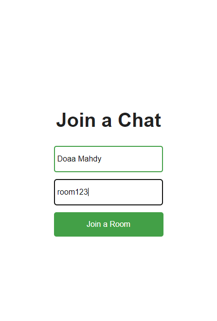
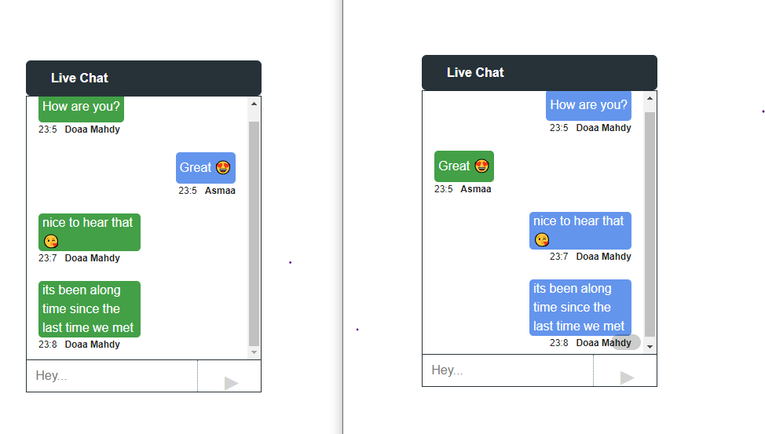

# 💬 Real-Time Chat App

A simple real-time chat application built with **React (Vite)** for the frontend and **Express + Socket.IO** for the backend. It supports joining rooms and chatting in real-time with auto-scroll and message formatting.

---

## 🧰 Tech Stack

- ⚛️ React (Vite)
- 🌐 Express.js
- 🔌 Socket.IO
- 🎨 CSS
- 🚀 Node.js

---

## 📦 Project Structure

```
chat-app/
├── client/     # React (Vite) frontend
├── server/     # Express + Socket.IO backend
```

---

## 🛠️ Setup Instructions

### 1. Clone the repository

```bash
git clone https://github.com/your-username/chat-app.git
cd chat-app
```

---

### 2. Backend Setup (server)

```bash
cd server
npm install
npm start     # runs with nodemon on http://localhost:3001
```

---

### 3. Frontend Setup (client)

```bash
cd ../client
npm install
npm run dev   # starts on http://localhost:5173
```

> ⚠️ Make sure both client and server are running concurrently.

---

## 🚀 Available Scripts

### In the `client` folder:

| Command           | Description                           |
| ----------------- | ------------------------------------- |
| `npm run dev`     | Starts Vite development server        |
| `npm run build`   | Builds the app for production         |
| `npm run preview` | Previews the production build locally |
| `npm run lint`    | Runs ESLint                           |

### In the `server` folder:

| Command     | Description                  |
| ----------- | ---------------------------- |
| `npm start` | Starts server with `nodemon` |

---

## 🧪 How It Works

- Users enter a name and room ID to join.
- Messages are sent via `socket.emit("send_message")`.
- Each message is broadcast to others in the room using `socket.to(room).emit("receive_message")`.
- Scroll-to-bottom ensures latest messages are visible.

---

## 📸 Screenshots

### Join Room Page



### Chat Interface



---

## 🙋‍♀️ Author

- **Doaa Mahdy** – [@Doaamahdy](https://github.com/Doaamahdy)
